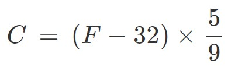

# So, how does it work?

## Input
This program takes input through the input() function

## The conversion equation

You've probably seen something like this in math class.

On line 16 in the code, you'll see:
<pre>
<code class="language-python">
  nDegreeC = (nDegreeF - 32) * 5 / 9
</code>
</pre>

Which looks a lot like the formula you learned in math class!  Sure, the variables have different names, but this computer program does all the work faster than you can write out the problem.  

## Decisions
Lines 21-26 use if statements to check the temperature and output a message?  Would you change the message or temperatures at all?

## Output
And it outputs the answer in the terminal at the bottom of the screen.

## Discussion
* What ways do you give input to programs you use on a computer or phone?
